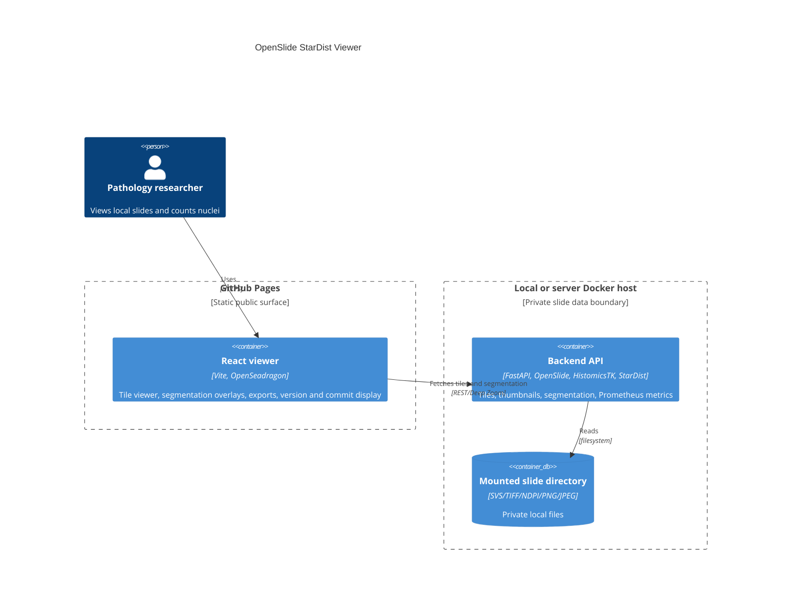

# OpenSlide StarDist Viewer


Live site: https://baditaflorin.github.io/openslide-stardist-viewer/

Repository: https://github.com/baditaflorin/openslide-stardist-viewer

Support: https://www.paypal.com/paypalme/florinbadita

OpenSlide StarDist Viewer is a static GitHub Pages pathology viewer backed by a local Docker API for OpenSlide tile streaming, StarDist/HistomicsTK nuclei segmentation, and repeatable cell counts.


## Quickstart

```bash
git clone https://github.com/baditaflorin/openslide-stardist-viewer.git
cd openslide-stardist-viewer
cp .env.example .env
make backend-venv
make smoke
```

`make smoke` builds the Pages artifact, starts the local backend with a generated demo slide, opens the static viewer in Playwright, segments the viewport, and checks the export controls.

For your own slides:

```bash
mkdir -p data/slides
cp /path/to/your/slides/* data/slides/
cd backend && SLIDE_VIEWER_SLIDE_DIR=../data/slides ../.venv/bin/python -m uvicorn app.main:app --host 127.0.0.1 --port 25342
```

Then open https://baditaflorin.github.io/openslide-stardist-viewer/ and keep the backend URL set to `http://localhost:25342`.

## Shipped Features

- GitHub Pages React viewer with OpenSeadragon tile streaming from a configurable backend.
- Local FastAPI backend for OpenSlide-compatible slides, scan diagnostics, Deep Zoom tiles, Prometheus metrics, and StarDist/HistomicsTK/fallback segmentation.
- Nuclei count overlays with confidence, tissue coverage, warnings, provenance, version, and commit display.
- Browser take-out paths: segmentation JSON, nuclei CSV, copied summary, copied curl command, and print.
- Portable session state: save/import JSON, share a small hash link, persisted backend URL, selected slide, and max nuclei setting.

## Limitations

- Slides are loaded from the backend slide directory, not uploaded directly into GitHub Pages.
- Remote slide URL ingestion, browser WSI drag/drop, backend result databases, auth, and cross-device sync are not part of v0.3.0.
- The public Pages frontend never stores secrets or slide pixels. Segmentation results are saved only when you explicitly export or copy them.

## Architecture



More detail: `docs/architecture.md`.

## Project Docs

- Architecture decisions: `docs/adr/`
- API: `docs/api.md`
- Deployment: `deploy/README.md`
- Runbook: `docs/runbook.md`
- Privacy: `docs/privacy.md`
- Postmortem: `docs/postmortem.md`

## Development

```bash
npm install
make backend-venv
make install-hooks
make lint
make test
make build
```

`make build` writes the GitHub Pages artifact to `docs/`. No GitHub Actions are used; local hooks run linting, tests, build, smoke, Conventional Commits validation, and gitleaks scanning.

## Backend

The backend reads from `SLIDE_VIEWER_SLIDE_DIR`, defaults to `/data/slides` in Docker, and exposes:

- `GET /api/slides`
- `GET /api/slides/{slide_id}/dzi`
- `GET /api/slides/{slide_id}_files/{level}/{column}_{row}.jpeg`
- `POST /api/slides/{slide_id}/segment`
- `GET /metrics`

The Docker image is `ghcr.io/baditaflorin/openslide-stardist-viewer`.

Build amd64 locally:

```bash
make docker-build
```

Push to GHCR:

```bash
make docker-push
```
