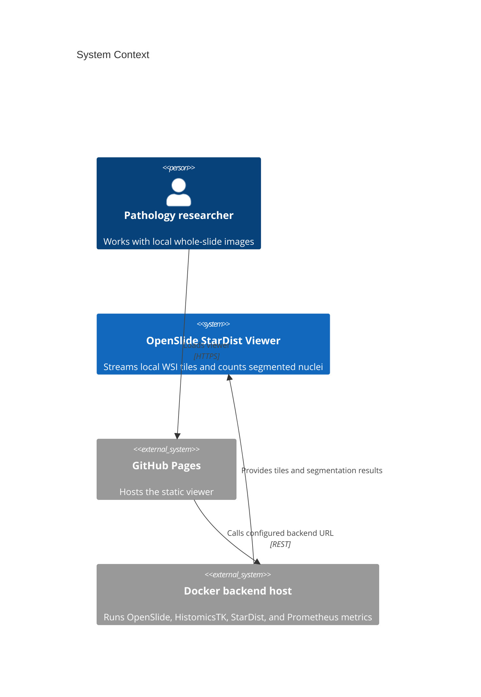
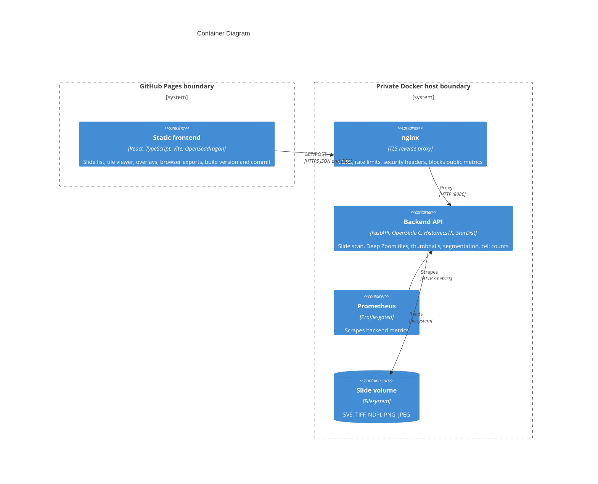
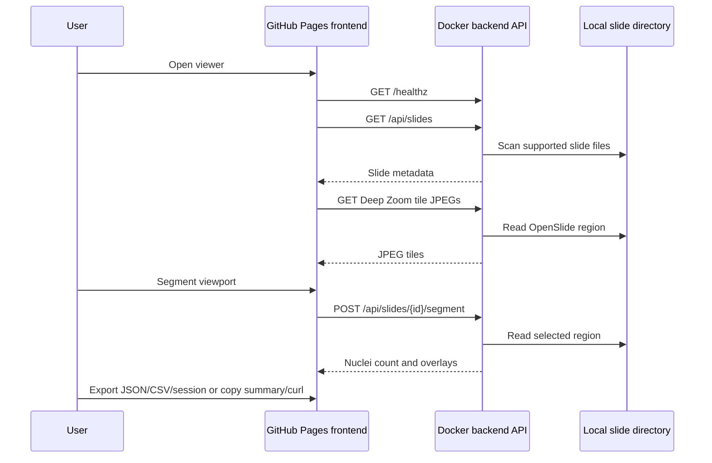

# Architecture

Live frontend: https://baditaflorin.github.io/openslide-stardist-viewer/

Repository: https://github.com/baditaflorin/openslide-stardist-viewer

## Context

## Containers

## Module Boundaries

- `src/`: static viewer UI and typed API client.
- `backend/app/api/`: FastAPI routes.
- `backend/app/slides/`: slide discovery, OpenSlide/Pillow readers, Deep Zoom tile geometry.
- `backend/app/segmentation/`: StarDist, HistomicsTK, and fallback segmentation.
- `backend/app/metrics/`: Prometheus counters and histograms.
- `deploy/`: production Compose, nginx, Prometheus, and dashboard assets.
- `docs/`: GitHub Pages build output plus durable documentation.

## Data Flow

